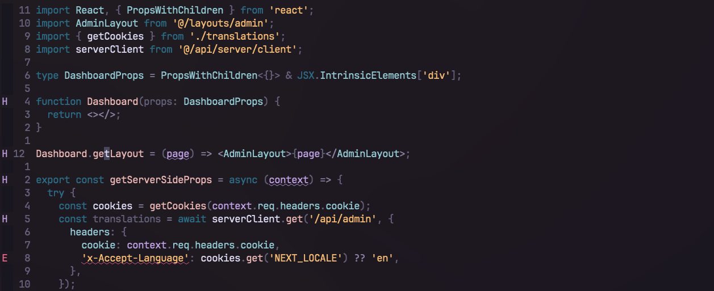
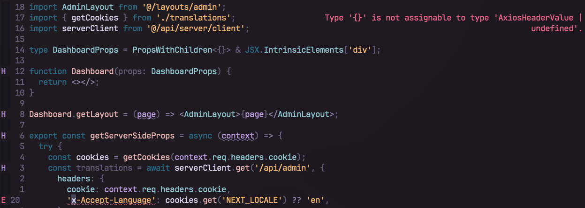
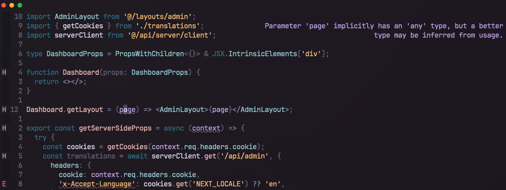
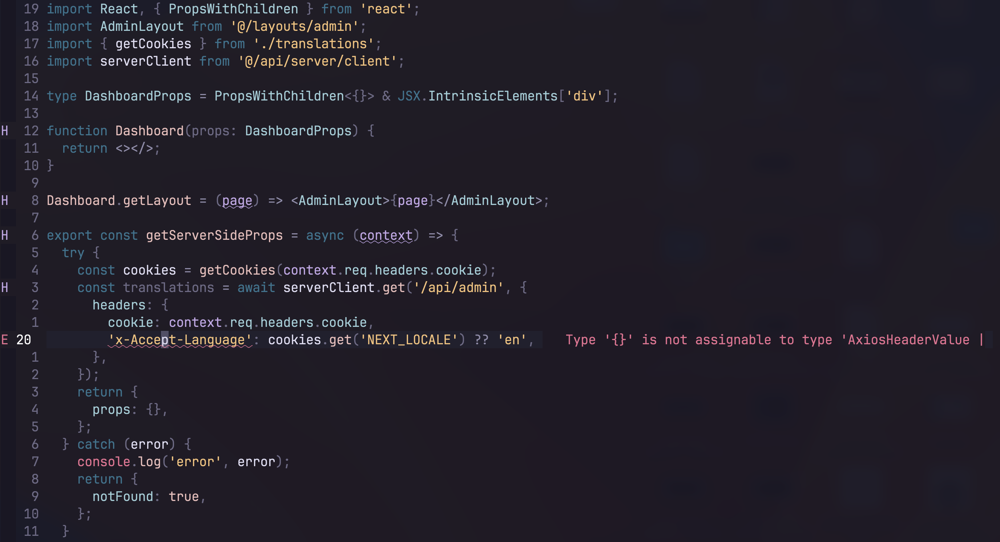

# diagflow.nvim

**diagflow.nvim** is a Neovim plugin that provides a neat and distraction-free way to display LSP diagnostics. It shows diagnostics in virtual text at the top-right corner of your screen, only when the cursor is positioned over the problematic code or across an entire line, according to your preference. This provides a clean and focused coding environment. This approach to diagnostics management is inspired by the Helix editor.

## Example

1. Opening a file with multiple diagnostics but no issues under the cursor:



2. An error under the cursor:



3. A hint under the cursor:



## Installation

To install **diagflow.nvim**, use your preferred Neovim package manager. If you're using `packer.nvim`, add the following line to your plugin list:

```lua
-- Packer
use {'dgagn/diagflow.nvim'}
```

If you're using `lazy.nvim`, add the following line to your plugin list:

```lua
-- Lazy
{
    'dgagn/diagflow.nvim',
    opts = {}
}
```

## Configuration

**Note** if you are using the `opts` with `lazy.nvim`, you don't need to run the setup, it does it for you.

The scope option determines the context of diagnostics display: 'cursor' (default) shows diagnostics only under the cursor, while 'line' shows diagnostics for the entire line where the cursor is positioned.

```lua
require('diagflow').setup({
    enable = true,
    max_width = 60,  -- The maximum width of the diagnostic messages
    severity_colors = {  -- The highlight groups to use for each diagnostic severity level
        error = "DiagnosticFloatingError",
        warning = "DiagnosticFloatingWarn",
        info = "DiagnosticFloatingInfo",
        hint = "DiagnosticFloatingHint",
    },
    gap_size = 1,
    scope = 'cursor', -- 'cursor', 'line'
    padding_top = 0,
    padding_right = 0,
    text_align = 'right', -- 'left', 'right'
    placement = 'top', -- 'top', 'inline'
    inline_padding_left = 0, -- the padding left when the placement is inline
})
```

Or simply use the default configuration:

```lua
require('diagflow').setup()
```

## FAQ

1. How do I change the colors of the virtual text?

You can set up custom colors by changing the highlight group in the configuration. For instance, in the default configuration, `:hi Hint` determines the color of the hints. You can change the hint color to blue with `:hi Hint guifg=blue`.

2. Can I still have the diagnostics inline?

Yes, with the new option `placement`, you can set the diagnostics inline instead of at
the top right.

Here is a example :



Here is the example config used in this screenshot :

```lua
{
  'dgagn/diagflow.nvim',
  opts = {
    placement = 'inline',
    inline_padding_left = 3,
  },
}
```

3. How can I disable the cursor when I enter insert mode and reenable it when I go in normal mode?

```lua
{
  'dgagn/diagflow.nvim',
  opts = {
    toggle_event = { 'InsertEnter' },
  },
}
```

4. Something doesn't update when X or Y happens.

You can setup when the diagnostic is cached with this option :

```lua
{
  'dgagn/diagflow.nvim',
  opts = {
    update_event = { 'DiagnosticChanged', ... },
  },
}
```


